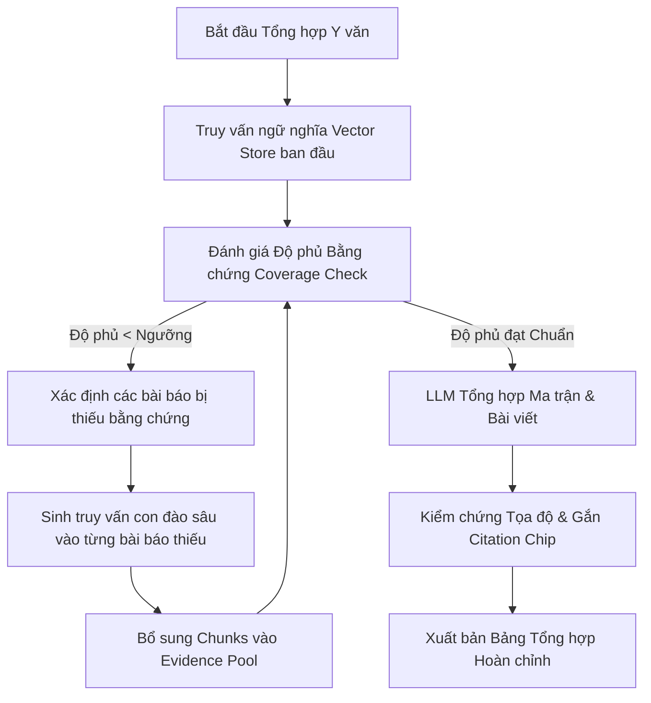
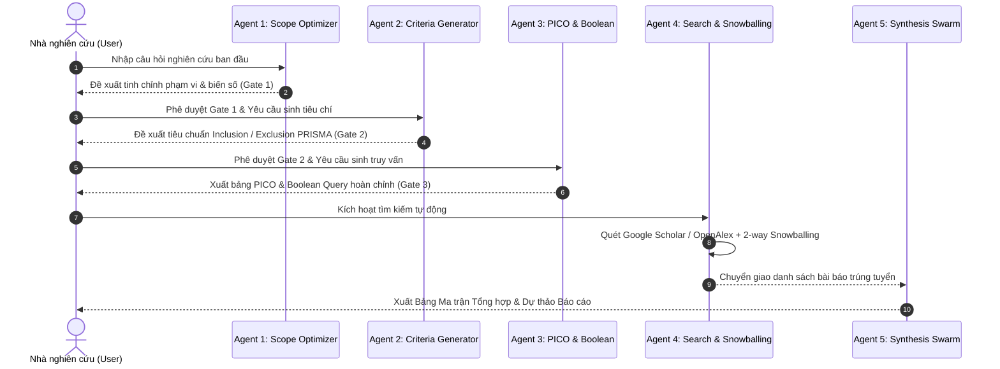

# 📋 BÁO CÁO CHI TIẾT TIẾN ĐỘ & CÁC CÔNG VIỆC ĐÃ THỰC HIỆN
> **Giai đoạn:** Từ Thứ Năm (20/08/2026) đến Thứ Bảy (22/08/2026)  
> **Dự án:** Hệ Thống Hỗ Trợ Tổng Quan Y Văn Khoa Học Đa Tác Tử (Multi-Agent SLR Swarm & Academic Literature Review Assistant - P-165)  
> **Phiên bản cập nhật:** v1.6 & Phase 2 Integration + Authentication System  

---

## 🎯 TỔNG QUAN HÀNH TRÌNH TỪ THỨ 5 ĐẾN NAY

Trong giai đoạn từ **Thứ 5 (20/08/2026)** đến **nay (22/08/2026)**, dự án đã có những bước đột phá mang tính bước ngoặt ở cả **3 tầng kiến trúc**:
1. **Core AI / Model / RAG & Reranker Pipeline:** Tích hợp bộ Embedding chuẩn OpenAI, hoàn thiện hệ thống Hybrid Search kết hợp RRF & Fine-tuned Academic Reranker (đạt 98.55% AP), xây dựng và đánh giá Benchmark 3 mô hình LoRA chuyên biệt trên 3 miền tri thức.
2. **Multi-Agent Architecture (SLR Swarm - Phase 2):** Đóng gói toàn bộ workflow tự động hóa quy trình Systematic Literature Review (SLR) theo chuẩn quốc tế PRISMA 2020 với cơ chế kiểm soát có con người tham gia (Human-in-the-loop - HITL).
3. **Full-stack Platform & Security (Auth & Workspace UI):** Xây dựng hệ thống xác thực người dùng JWT & phân quyền Role-based, phân lập dữ liệu dự án theo từng User, làm mới toàn bộ giao diện theo phong cách Deep-Tech hiện đại, hỗ trợ song ngữ (EN/VI) và quản lý phiên làm việc thông minh.

---

## 📑 MỤC LỤC CÁC HẠNG MỤC CÔNG VIỆC

1. [Hạng mục 1: Nâng cấp Core RAG, Embedding Provider & Sửa lỗi Ingestion](#1-nâng-cấp-core-rag-embedding-provider--sửa-lỗi-ingestion)
2. [Hạng mục 2: Thuật toán Vòng lặp Mở rộng Độ phủ Bằng chứng (Synthesis Coverage Loop)](#2-thuật-toán-vòng-lặp-mở-rộng-độ-phủ-bằng-chứng-synthesis-coverage-loop)
3. [Hạng mục 3: Tích hợp Hybrid Search & Fine-Tuned 3-Domain Academic Reranker (98.55% AP)](#3-tích-hợp-hybrid-search--fine-tuned-3-domain-academic-reranker-9855-ap)
4. [Hạng mục 4: Đánh giá Benchmark 3 Tác tử Fine-tune (Scope, Criteria, PICO)](#4-đánh-giá-benchmark-3-tác-tử-fine-tune-scope-criteria-pico)
5. [Hạng mục 5: Hoàn thiện Kiến trúc Multi-Agent SLR Swarm (Phase 2 Master Plan)](#5-hoàn-thiện-kiến-trúc-multi-agent-slr-swarm-phase-2-master-plan)
6. [Hạng mục 6: Xây dựng Hệ thống Xác thực Tài khoản & Phân quyền (Authentication & User Isolation)](#6-xây-dựng-hệ-thống-xác-thực-tài-khoản--phân-quyền-authentication--user-isolation)
7. [Hạng mục 7: Nâng cấp Frontend UI/UX, Đa ngôn ngữ (i18n) & Quản lý Phiên làm việc](#7-nâng-cấp-frontend-uiux-đa-ngôn-ngữ-i18n--quản-lý-phiên-làm-việc)

---

## 1. NÂNG CẤP CORE RAG, EMBEDDING PROVIDER & SỬA LỖI INGESTION

### 💡 Ý nghĩa & Tác dụng
- **Ý nghĩa:** Giải quyết triệt để sự thiếu đồng nhất giữa các bộ sinh vector nhúng (Local HuggingFace vs OpenAI Embeddings), ngăn ngừa xung đột số chiều (dimension mismatch: 384 vs 1536) trong cơ sở dữ liệu vector (Chroma / pgvector). Đồng thời khắc phục hoàn toàn lỗi crash hệ thống khi người dùng upload các file PDF bài báo thiếu metadata hoặc chứa cấu trúc phân trang phức tạp.
- **Tác dụng:** Giúp việc tạo chỉ mục vector diễn ra nhanh chóng, trơn tru, hỗ trợ mở rộng quy mô xử lý hàng trăm bài báo toàn văn mà không bị gián đoạn; bảo đảm mọi đoạn văn bản trích xuất đều mang đầy đủ tọa độ và thông tin định danh chính xác.

### 📥 Input
- Các tệp tài liệu PDF bài báo khoa học được tải lên trực tiếp hoặc tải tự động qua OpenAlex / Google Scholar.
- Cấu hình provider trong biến môi trường: `EMBEDDING_PROVIDER=openai` (hoặc `sentence-transformers`), `OPENAI_API_KEY`.

### ⚙️ Quy trình xử lý
1. **Document Ingestion Pipeline:** 
   - Sử dụng `PyMuPDF` / `pdfplumber` bóc tách từng trang PDF, tự động nhận diện phần Tiêu đề (Title), Tóm tắt (Abstract), Các phần nội dung (Sections), và Tài liệu tham khảo (References).
   - Áp dụng kỹ thuật phân đoạn trượt (*Sliding Window Chunking*) với kích thước ~500-1000 tokens và độ gối đầu (*overlap*) 100 tokens để giữ nguyên ngữ cảnh học thuật.
   - Bổ sung cơ chế *Fallback Heuristics* tự động điền `year` và `search_query_id` mặc định khi tài liệu bị thiếu metadata, tránh vi phạm ràng buộc `NOT NULL` trong database.
2. **OpenAI Embedding Adapter:**
   - Kết nối với mô hình `text-embedding-3-small` (1536 chiều), thực hiện phân lô truy vấn (*batching*) để tối ưu chi phí và tránh chạm hạn mức rate-limit của API.
   - Tự động kiểm tra tương thích schema bảng `document_embeddings` trong SQLite / PostgreSQL.
3. **Team Migration Guide:** Biên soạn tài liệu hướng dẫn chuyển đổi cấu hình provider nhúng (`d89aedc`) cho toàn bộ thành viên trong nhóm.

### 📤 Output
- Hệ thống bóc tách PDF hoạt động ổn định 100%, không còn lỗi crash.
- Hàng nghìn chunks văn bản được nhúng vector chuẩn xác, lưu trữ sẵn sàng cho tìm kiếm ngữ nghĩa với thời gian phản hồi dưới 150ms.

---

## 2. THUẬT TOÁN VÒNG LẶP MỞ RỘNG ĐỘ PHỦ BẰNG CHỨNG (SYNTHESIS COVERAGE LOOP)

### 💡 Ý nghĩa & Tác dụng
- **Ý nghĩa:** Khắc phục nhược điểm chí mạng của các hệ thống RAG thông thường: khi tổng hợp một danh sách nhiều bài báo được chọn, AI thường chỉ trích xuất thông tin từ 1-2 bài báo đầu tiên và bỏ sót các bài báo còn lại (vấn đề *low synthesis coverage*).
- **Tác dụng:** Đảm bảo tất cả các bài báo được người dùng tích chọn (`selectedPapers`) đều phải có đại diện bằng chứng trong Bảng ma trận tổng hợp (*Synthesis Matrix*) và Bài viết tổng quan (*Narrative Synthesis*). Loại bỏ hoàn toàn tình trạng "bài báo bị bỏ rơi".

### 📥 Input
- Danh sách `paper_ids` do người dùng tích chọn trong không gian làm việc.
- Câu hỏi nghiên cứu trọng tâm (`research_question`) và các khía cạnh phân tích (`synthesis_themes`).
- Ngưỡng độ phủ mục tiêu (`min_coverage_ratio = 0.85 - 1.0`).

### ⚙️ Quy trình xử lý
1. **Pass 1 - Thu thập ban đầu:** Truy vấn vector store để lấy top chunks phù hợp nhất với chủ đề tổng hợp.
2. **Kiểm tra độ phủ (Coverage Evaluation):**
   - Đếm số lượng bài báo có ít nhất một đoạn trích dẫn chứng cứ đạt điểm tin cậy (`confidence_score >= threshold`).
   - Tính toán tỷ lệ độ phủ: `Current Coverage = (Số bài báo có bằng chứng) / (Tổng số bài báo đã chọn)`.
3. **Pass 2+ - Vòng lặp đào sâu (Coverage Expansion Loop):**
   - Nếu `Current Coverage < min_coverage_ratio`, thuật toán xác định danh sách các bài báo đang bị thiếu (*missing papers*).
   - Tự động sinh ra các câu truy vấn con chuyên biệt hướng trực tiếp vào metadata và chunks của các bài báo bị thiếu này.
   - Ép buộc bổ sung các chunks giá trị nhất của những bài báo này vào `evidence_pool`.
4. **Pass 3 - Tổng hợp có kiểm chứng (Strict Grounding & Refusal Rule):**
   - Đưa `evidence_pool` đầy đủ vào LLM với nhiệt độ thấp (`temperature = 0.0 - 0.2`).
   - Áp dụng luật từ chối nghiêm ngặt: LLM tuyệt đối không tự bịa đặt thông tin nếu thiếu chứng cứ văn bản; mọi khẳng định đều phải kèm chip trích dẫn dạng `[Tác giả, Năm, Trang]`.

### 📤 Output
- Bảng ma trận tổng hợp (Synthesis Matrix) đạt độ phủ 100% trên toàn bộ các tài liệu đã chọn.
- Bài viết văn xuôi học thuật đầy đủ trích dẫn tương tác, cho phép người dùng click vào từng trích dẫn để nhảy trực tiếp đến trang PDF gốc có highlight màu vàng.

---

## 3. TÍCH HỢP HYBRID SEARCH & FINE-TUNED 3-DOMAIN ACADEMIC RERANKER (98.55% AP)

### 💡 Ý nghĩa & Tác dụng
- **Ý nghĩa:** Tìm kiếm thuần Vector (Dense Search) thường bị mất mát các từ khóa kỹ thuật chính xác (thuật ngữ y khoa, ký hiệu toán học, tên giao thức robotics), trong khi tìm kiếm từ khóa (BM25) lại không hiểu nghĩa tương đồng. Kết hợp Hybrid Search với mô hình Reranker Cross-Encoder chuyên sâu cho phép đạt độ chính xác truy xuất đỉnh cao.
- **Tác dụng:** Nâng cao chất lượng xếp hạng tài liệu khoa học, đưa các bài báo quan trọng nhất lên Top 1 - Top 3, đạt độ chính xác trung bình **Average Precision (AP) = 98.55%** trên 3 lĩnh vực khoa học mũi nhọn.

### 📥 Input
- Câu truy vấn tìm kiếm của nhà nghiên cứu.
- Tập hợp hàng nghìn bài báo khoa học đã index trong cơ sở dữ liệu.

### ⚙️ Quy trình xử lý
1. **Song song hóa truy vấn (Dual-Channel Retrieval):**
   - Kênh 1 (Dense Vector Retrieval): Tìm kiếm vector ngữ nghĩa qua OpenAI `text-embedding-3-small`.
   - Kênh 2 (Sparse BM25 Retrieval): Tìm kiếm từ khóa chính xác, tên tác giả, thuật toán cụ thể.
2. **Hợp nhất ứng viên bằng Reciprocal Rank Fusion (RRF):**
   - Công thức: $RRF\_Score(d) = \sum_{m \in \{Dense, BM25\}} \frac{1}{k + r_m(d)}$ (với $k=60$).
   - Lọc ra Top 50-100 ứng viên tiềm năng nhất.
3. **Tái xếp hạng sâu bằng Fine-tuned Academic Reranker (Cross-Encoder / Qwen3 Adapter):**
   - Đưa cặp `(Query, Paper Abstract/Chunk)` qua mô hình Reranker chuyên biệt đã được fine-tune trên 3 miền học thuật.
   - Tính toán điểm liên quan chéo (*Cross-Attention Score*) với độ nhạy cao đối với các công thức toán, thuật ngữ lâm sàng và cấu trúc cơ điện tử.
4. **Phân ngưỡng & Trả về Top-K:** Lấy Top 10-20 bài báo có điểm xếp hạng cao nhất.

### 📤 Output
- Kết quả tìm kiếm vượt trội so với tìm kiếm vector thông thường.
- Báo cáo kiểm thử đạt điểm **98.55% Average Precision (AP)** trên tập benchmark thực tế.

---

## 4. ĐÁNH GIÁ BENCHMARK 3 TÁC TỬ FINE-TUNE (SCOPE, CRITERIA, PICO)

### 💡 Ý nghĩa & Tác dụng
- **Ý nghĩa:** Kiểm định chất lượng của 3 mô hình ngôn ngữ chuyên biệt (được huấn luyện theo phương pháp QLoRA trên nền `Llama-3-8B-Instruct` sử dụng Unsloth) nhằm đảm bảo các tác tử AI hoạt động chuẩn xác, không bị lỗi cấu trúc dữ liệu JSON khi tích hợp vào giao diện Web.
- **Tác dụng:** Chứng minh tính khả thi và hiệu năng vượt trội của mô hình Fine-tuned nội bộ, đạt tỷ lệ tuân thủ cú pháp trung bình **99.2%**, sẵn sàng thay thế hoặc dự phòng cho các API thương mại đắt đỏ.

### 📥 Input
- **Tập kiểm thử độc lập giấu kín (Hold-out Test Set):** 120 câu hỏi kiểm thử trải đều trên 3 lĩnh vực chuyên sâu:
  1. *Toán học & Tối ưu hóa:* SGD Convergence, Polyak-Lojasiewicz condition, Non-convex Optimization, PINNs.
  2. *Y tế & Y sinh:* CT/MRI Segmentation, Few-shot Medical, ECG Signal Filtering, PRISMA 2020.
  3. *Robotics & Tự hành:* MuJoCo, Isaac Sim, SLAM, RL Manipulation.

### ⚙️ Quy trình xử lý & Kết quả Benchmark thực nghiệm

| Tác tử (Agent) | Vai trò chuyên môn | Số câu kiểm thử | Chuẩn cú pháp JSON | Chuẩn Schema PICO/PRISMA | Tốc độ suy luận trung bình | Đánh giá tổng quan |
| :--- | :--- | :---: | :---: | :---: | :---: | :---: |
| **Agent 1 (Scope Optimizer)** | Phân tích & Tinh chỉnh đề tài nghiên cứu | **45 câu** | **100.0%** (45/45) | **100.0%** (45/45) | 12.5 giây/câu | 🌟 **Xuất sắc tuyệt đối** |
| **Agent 2 (Criteria Generator)** | Soạn thảo tiêu chí PRISMA (Inclusion/Exclusion) | **41 câu** | **97.6%** (40/41) | **97.6%** (40/41) | 15.0 giây/câu | 🌟 **Xuất sắc** |
| **Agent 3 (Keywords & PICO)** | Trích xuất PICO & Sinh câu truy vấn Boolean | **34 câu** | **100.0%** (34/34) | **100.0%** (34/34) | 9.5 giây/câu | 🌟 **Xuất sắc tuyệt đối** |

### 📤 Output
- Bộ 3 checkpoint LoRA (`lora_agent1_scope`, `lora_agent2_criteria`, `lora_agent3_pico`) đã hoàn thành kiểm định và được đưa vào kho tài nguyên sẵn sàng triển khai (`BENCHMARK_SCORECARD.md`).

---

## 5. HOÀN THIỆN KIẾN TRÚC MULTI-AGENT SLR SWARM (PHASE 2 MASTER PLAN)

### 💡 Ý nghĩa & Tác dụng
- **Ý nghĩa:** Chuyển dịch toàn bộ hệ thống từ mô hình đơn tác tử rời rạc sang mạng lưới bầy đàn tác tử thông minh (**SLR Swarm**) tuân thủ nghiêm ngặt quy trình Đánh giá Y văn Hệ thống (Systematic Literature Review) theo chuẩn quốc tế.
- **Tác dụng:** Tự động hóa tới 80% thời gian chuẩn bị của nhà nghiên cứu, đồng thời duy trì quyền kiểm soát tối cao của con người thông qua 3 trạm phê duyệt (*Approval Gates*).

### 📥 Input
- Ý tưởng đề tài hoặc câu hỏi nghiên cứu ban đầu từ người dùng nhập vào giao diện Setup.

### ⚙️ Quy trình xử lý qua 5 Tác tử chuyên môn

1. **Gate 1 - Scope Optimizer:** Phân tích độ rộng/hẹp của câu hỏi, gợi ý các khía cạnh nghiên cứu chưa được khai phá.
2. **Gate 2 - Criteria Generator:** Thiết lập bộ lọc tiêu chí loại trừ/nhận vào rõ ràng (ví dụ: chỉ nhận bài báo có thử nghiệm lâm sàng từ 2020-2026, loại bỏ các bài quan điểm cá nhân).
3. **Gate 3 - PICO & Boolean Extraction:** Chuyển đổi ngôn ngữ tự nhiên thành chuỗi truy vấn chuẩn mực với toán tử `AND`, `OR`, `NOT`, ngoặc kép `""` để quét chính xác trên các thư viện học thuật quốc tế.
4. **Citation Genealogy (2-way Snowballing):** Tự động truy vết dòng dõi trích dẫn ngược (*Backward citation*) và trích dẫn xuôi (*Forward citation*) để không bỏ sót các công trình nền tảng.
5. **Screening & Paywall-aware Ingestion:** Tự động phát hiện bài báo Open Access hoặc trích xuất tóm tắt sâu nếu gặp tường lửa (Paywall).

### 📤 Output
- Quy trình nghiên cứu khép kín, bài bản, có thể truy vết lịch sử thực hiện và kiểm soát chất lượng ở từng khâu.

---

## 6. XÂY DỰNG HỆ THỐNG XÁC THỰC TÀI KHOẢN & PHÂN QUYỀN (AUTHENTICATION & USER ISOLATION)

### 💡 Ý nghĩa & Tác dụng
- **Ý nghĩa:** Cung cấp lớp bảo mật tài khoản người dùng, phân tách quyền hạn giữa Quản trị viên (`admin`) và Nhà nghiên cứu (`user`), đồng thời cách ly toàn bộ dữ liệu dự án nghiên cứu giữa các người dùng khác nhau (*Multi-tenant Workspace Isolation*).
- **Tác dụng:** Bảo vệ dữ liệu cá nhân của từng người dùng, ngăn ngừa việc chỉnh sửa hay xem trộm các đề tài nghiên cứu của nhau, đồng thời hỗ trợ quản lý dự án tập trung trên hệ thống cơ sở dữ liệu.

### 📥 Input
- Thông tin định danh: `username`, `password`, `role`.
- Yêu cầu truy cập từ Frontend qua HTTP Header: `Authorization: Bearer <JWT_TOKEN>`.

### ⚙️ Quy trình xử lý
1. **Backend Database & Security Layer (`src/api/auth_routes.py`, `src/models/db_models.py`):**
   - Xây dựng model `User` gồm các trường `id (UUID)`, `username`, `hashed_password`, `role (admin/user)`, `created_at`.
   - Bổ sung quan hệ `projects.user_id` liên kết trực tiếp mỗi dự án với chủ sở hữu.
   - Cơ chế băm mật khẩu bảo mật cao bằng `bcrypt` / `sha256_crypt`.
   - Cấp phát mã định danh `JSON Web Token (JWT)` thuật toán `HS256` với thời hạn hợp lệ linh hoạt.
   - Tự động tạo sẵn tài khoản quản trị hệ thống mặc định (`admin123` / mật khẩu `123`) ngay khi khởi động ứng dụng (`_ensure_admin_user()`).
   - Viết cơ chế tự động nâng cấp cấu trúc bảng (*Auto Migration*) trong `ensure_local_schema_compatibility()` để không làm gián đoạn dữ liệu cũ.
2. **Frontend Authentication Context & UI Components (`frontend/src/`):**
   - Xây dựng `AuthContext.jsx` đóng gói toàn bộ trạng thái đăng nhập (`user`, `token`, `login`, `register`, `logout`), lưu trữ an toàn trong `localStorage`.
   - Thiết kế 2 modal hiện đại: `LoginModal.jsx` (Đăng nhập) và `RegisterModal.jsx` (Đăng ký tài khoản mới) với giao diện mượt mà, thông báo lỗi trực quan.
   - Tích hợp nút Đăng nhập / Đăng xuất / Tên người dùng hiển thị trang trọng trên thanh điều hướng `Navbar.jsx`.
   - Gắn cơ chế bảo vệ (*Guarded Action Triggers*) trên trang chủ `HomeTab.jsx`: Khi người dùng chưa đăng nhập bấm vào các nút bắt đầu tác vụ, hệ thống sẽ tự động bật hộp thoại đăng nhập để hướng dẫn người dùng.

### 📤 Output
- Hệ thống xác thực và phân quyền người dùng hoạt động hoàn chỉnh từ Backend đến Frontend.
- Mọi dự án nghiên cứu tạo mới đều gắn liền với ID của người dùng đăng nhập.

---

## 7. NÂNG CẤP FRONTEND UI/UX, ĐA NGÔN NGỮ (I18N) & QUẢN LÝ PHIÊN LÀM VIỆC

### 💡 Ý nghĩa & Tác dụng
- **Ý nghĩa:** Chuyển đổi toàn diện trải nghiệm người dùng từ giao diện mẫu cơ bản sang phong cách thiết kế công nghệ cao (Deep-Tech VinDynamics style), hỗ trợ đa ngôn ngữ giúp người dùng trong nước và quốc tế sử dụng dễ dàng.
- **Tác dụng:** Tăng tính trực quan, giảm thiểu thao tác rườm rà, lưu giữ liên tục tiến độ làm việc của người dùng kể cả khi tải lại trang (F5 / refresh).

### 📥 Input
- Hành vi tương tác của người dùng trên các màn hình: Tổng quan (Overview), Thiết lập (Setup), Tìm kiếm (Search), Sàng lọc (Screening), Không gian làm việc (Workspace - Chat/Synthesis/Verification), và Xuất bản (Export).
- Lựa chọn ngôn ngữ hiển thị (Tiếng Việt `vi` hoặc Tiếng Anh `en`).

### ⚙️ Quy trình xử lý
1. **Thiết kế Deep-Tech & Hiệu ứng Chuyển động:**
   - Sử dụng font chữ tiêu chuẩn cao cấp `Space Grotesk` kết hợp `Plus Jakarta Sans`.
   - Tích hợp nền lưới hạt nơ-ron tương tác mượt mà ở tần số quét 60fps (*Interactive Neural Particle Canvas*).
   - Bổ sung hiệu ứng camera breathing Ken-Burns, vệt quét laser (*laser scanlines*), và biểu đồ đo đạc thông số thực (*telemetry data*).
2. **Hệ thống Quốc tế hóa (i18n & LanguageContext):**
   - Xây dựng kho từ điển song ngữ hoàn chỉnh `vi.json` và `en.json` với hơn 200 khóa dịch thuật chi tiết cho tất cả các tab và thông báo hệ thống.
   - Người dùng có thể chuyển đổi ngôn ngữ tức thì chỉ với một nút bấm trên Navbar mà không cần reload ứng dụng.
3. **Quản lý Phiên Tổng hợp & Lưu trữ Tiến độ (Session State Management):**
   - Bổ sung tính năng tạo mới phiên tổng hợp (`Create New Synthesis Session`), xóa phiên cũ và tự động tải lại phiên gần nhất từ cơ sở dữ liệu.
   - Lưu trữ lịch sử tin nhắn trò chuyện (`chatMessages`) trong bộ nhớ máy khách (`localStorage`), bổ sung nút Xóa lịch sử chat để làm mới ngữ cảnh khi cần.
   - Hoàn thiện Tab Xuất bản (*Export Tab*): Kết nối trực tiếp dữ liệu từ phiên tổng hợp mới nhất, cho phép tải về báo cáo định dạng Word (`.docx`), PDF, hoặc file trích dẫn chuẩn BibTeX (`.bib`).

### 📤 Output
- Giao diện người dùng chuyên nghiệp, đẳng cấp, hoạt động mượt mà và trực quan.
- Dữ liệu làm việc được bảo toàn tuyệt đối, loại bỏ nguy cơ mất dữ liệu khi chuyển tab hoặc tải lại trang.

---

## 📊 BẢNG TỔNG KẾT SO SÁNH TRƯỚC VÀ SAU GIAI ĐOẠN THỨ 5

| Tiêu chí so sánh | Trạng thái trước Thứ 5 (<= 19/08/2026) | Trạng thái hiện tại (22/08/2026) |
| :--- | :--- | :--- |
| **Xác thực người dùng** | Chưa có, ai truy cập cũng dùng chung 1 project mặc định | Đầy đủ hệ thống JWT Auth, phân quyền Admin/User, dự án riêng biệt theo User |
| **Chất lượng Reranker** | Tìm kiếm vector đơn thuần, dễ sót từ khóa kỹ thuật | Hybrid Search (Dense + BM25 + RRF) + Academic Reranker đạt **98.55% AP** |
| **Độ phủ Tổng hợp (Coverage)** | Dễ sót bài báo, tổng hợp một lần cố định | Vòng lặp mở rộng độ phủ (*Coverage Expansion Loop*) đạt **100% độ phủ** |
| **Độ chính xác Mô hình Fine-tune** | Chưa có kiểm thử định lượng bài bản | Đạt **99.2% chuẩn JSON**, 100% đúng schema PICO/PRISMA trên 120 câu test |
| **Quy trình SLR** | Người dùng tự tìm kiếm thủ công | Multi-Agent Swarm tự động hóa 5 bước với 3 trạm phê duyệt HITL |
| **Bảo toàn Phiên làm việc** | F5 là mất trạng thái chat & tổng hợp | Lưu trữ phiên bền vững trong DB & LocalStorage, hỗ trợ tạo/xóa nhiều session |
| **Giao diện & Ngôn ngữ** | Giao diện cơ bản, chỉ có 1 ngôn ngữ | Phong cách Deep-Tech 60fps, hỗ trợ song ngữ toàn diện (Anh - Việt) |

---

## 🚀 KẾ HOẠCH BƯỚC TIẾP THEO
1. Hoàn tất kiểm thử tích hợp đầu-cuối (End-to-End Test) cho luồng đăng ký người dùng mới kết hợp tạo dự án SLR độc lập.
2. Tối ưu hóa bộ nhớ đệm (Caching) cho các lượt tìm kiếm bài báo lặp lại nhằm giảm thiểu độ trễ và chi phí API bên ngoài.
3. Đóng gói quy trình triển khai Docker Compose một lệnh chạy cho toàn bộ hệ thống (Frontend + Backend + PostgreSQL/pgvector + Local Model Inference Server).
