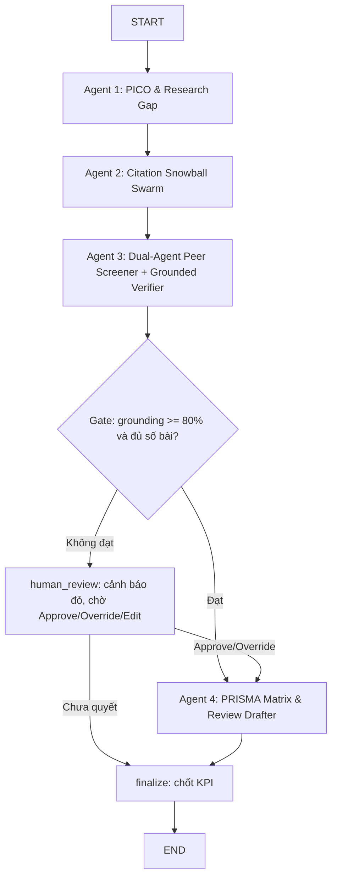

# SLR Swarm — Multi-Agent theo Phase 2 Master Plan

Nhánh: `feature/slr-swarm-phase2`

Đây là **cách triển khai multi-agent thứ hai** của dự án, song song với nhánh
`feature/multi-agent-synthesis`. Hai nhánh giải quyết hai bài toán khác nhau:

| | `feature/multi-agent-synthesis` | `feature/slr-swarm-phase2` (nhánh này) |
| :-- | :-- | :-- |
| Kiểu phối hợp | Fan-out QA workers + discovery agents | **Supervisor state graph** có checkpoint |
| Đơn vị công việc | 1 câu hỏi → nhiều worker chấm song song | 1 đề tài → 5 agent nối tiếp thành pipeline SLR |
| Điểm dừng người dùng | Không | **HITL interrupt** tại cổng Grounding |
| Chống bịa nguồn | Verdict do LLM chấm | Verifier **tất định**, LLM không tự chấm điểm mình |
| Đầu ra | Trace + verdict | Bảng PRISMA + bản thảo LaTeX/BibTeX + KPI |

---

## 1. Luồng 1 — Systematic Literature Review (§4.1 Master Plan)



Điểm cốt lõi: **cổng `gate` nằm giữa graph, không phải ở cuối**. Nếu grounding
không đạt ngưỡng, Agent 4 *không chạy* — hệ thống không sinh ra bản thảo mà nó
không chứng minh được. Muốn đi tiếp phải có người bấm nút.

## 2. Luồng 2 — Initial Data Analysis (§4.2)

`csv → profile_csv (tất định) → Agent 5 đề xuất phương pháp + sinh code → HITL`

Hồ sơ dữ liệu (số dòng, kiểu cột, tỉ lệ thiếu) do code đếm, không hỏi LLM — LLM
chỉ nhận số đã đo để chọn phương pháp. Code sinh ra **không được thực thi**, trả
về cho nghiên cứu viên tự chạy.

---

## 3. Cơ chế chống bịa nguồn (§7.1)

Đây là khác biệt lớn nhất về mặt kỹ thuật:

1. Reviewer/Extractor phải trả kèm `evidence_quotes` — **trích nguyên văn**, không diễn giải.
2. `grounding.locate_claim` đối chiếu từng trích dẫn với full-text theo cửa sổ ≤3 dòng,
   chấm điểm = 0.7 × độ phủ token nội dung + 0.3 × độ phủ bigram (bigram để loại
   kiểu "trúng từ rời rạc nhưng sai ngữ cảnh").
3. Không đạt `min_score` → trích dẫn bị **bỏ**, và điểm bài báo bị kéo xuống.
   `grounding_score = số claim chứng minh được / tổng số claim` — một claim bịa
   phải làm giảm điểm, không được lấy trung bình để ẩn đi.
4. Ô PRISMA không neo được → hiện `n/a` trong bảng LaTeX.
5. Mỗi span giữ `[page, line_start, line_end, quote]` để frontend highlight đúng chỗ.

## 4. Dual-Agent Peer Screener (§5.3)

Hai reviewer chạy song song với thiên hướng ngược nhau:

- `inclusive` — sợ bỏ sót, chỉ loại khi rõ ràng lạc đề.
- `strict` — sợ nhận nhầm, chỉ giữ khi thoả đủ tiêu chí.

Trùng ý kiến → lấy bên tự tin hơn. Bất đồng → mới gọi `adjudicator`. Nhờ vậy chi
phí lượt thứ ba chỉ phát sinh ở ca khó, không phải mọi bài.

## 5. Model routing & KPI (§6, §7.3)

`ModelRouter.pick(task)` ép `screening` và `extraction` chạy **model local**
(`SLR-Grounded-Screener-8B` / `SLR-PRISMA-Code-Extractor-7B`), chỉ `planning` mới
được ra cloud. Router đếm số lần gọi local để `kpi.estimated_cost_saved` quy ra
tiền API né được.

`compute_kpi` ưu tiên đo trên bản thảo cuối (`grounded_claim_count / claim_count`)
vì đó mới là thứ nghiên cứu viên thực sự đọc.

---

## 6. Cấu trúc mã nguồn

```
src/agents/slr_swarm/
├── contracts.py      # Data contract giữa các agent (pydantic)
├── ports.py          # Protocol: LLMPort, SearchPort, CitationPort, CorpusPort + SwarmDeps
├── state.py          # SLRState / DataAnalysisState + reducer merge_papers
├── grounding.py      # Grounded Verifier (tất định, không dùng LLM)
├── json_utils.py     # Bóc JSON chịu lỗi từ output model local
├── kpi.py            # Dashboard KPI realtime
├── graph.py          # Master Orchestrator: build_slr_graph / build_data_graph
├── stubs.py          # Adapter in-memory để chạy offline
├── deps_provider.py  # Lắp ráp SwarmDeps mặc định
└── agents/           # 5 tác tử
src/api/slr_swarm_routes.py
tests/test_agents/test_slr_swarm/
tests/test_api/test_slr_swarm_routes.py
```

## 7. Chạy thử

```bash
pytest tests/test_agents/test_slr_swarm tests/test_api/test_slr_swarm_routes.py -q

# Hoặc gọi API (chạy được ngay, không cần API key — dùng adapter in-memory)
curl -X POST localhost:8000/api/v1/slr-swarm/review \
  -H "Content-Type: application/json" \
  -d '{"idea":"deep learning cho ECG","inclusion_criteria":["nghiên cứu trên người"]}'
```

## 8. Trạng thái & việc còn lại

**Đã có, chạy được:** toàn bộ graph 2 luồng, 5 agent, verifier, cổng grounding,
HITL routing, KPI, API, 48 test.

**Chưa nối (skeleton dừng ở port):**

| Port | Hiện tại | Cần thay bằng |
| :-- | :-- | :-- |
| `LLMPort` | `ScriptedLLM` in-memory | vLLM/Ollama client cho 2 model fine-tuned |
| `SearchPort` | `InMemorySearch` | `src/services/search_service.py` (SerpApi/OpenAlex) |
| `CitationPort` | `InMemoryCitations` | OpenAlex / Semantic Scholar citation graph |
| `CorpusPort` | `InMemoryCorpus` | `src/services/document_processor.py` (PyMuPDF theo trang) |

Ngoài ra chưa làm: persist state vào PostgreSQL qua `langgraph-checkpoint-postgres`
(hàm `build_slr_graph` đã nhận sẵn tham số `checkpointer`), và UI Gap Heatmap /
Dashboard KPI ở frontend.
