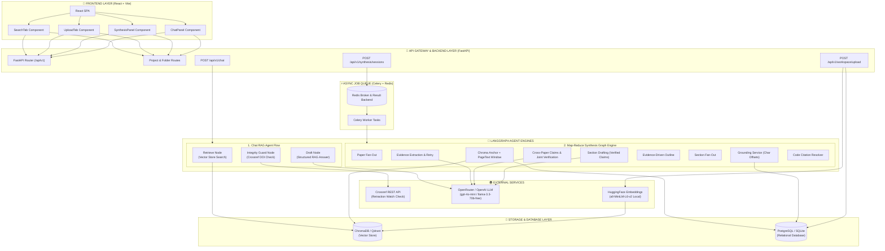
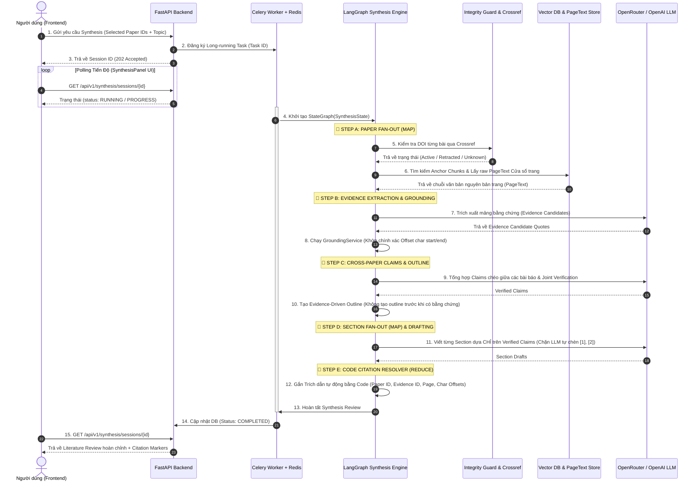
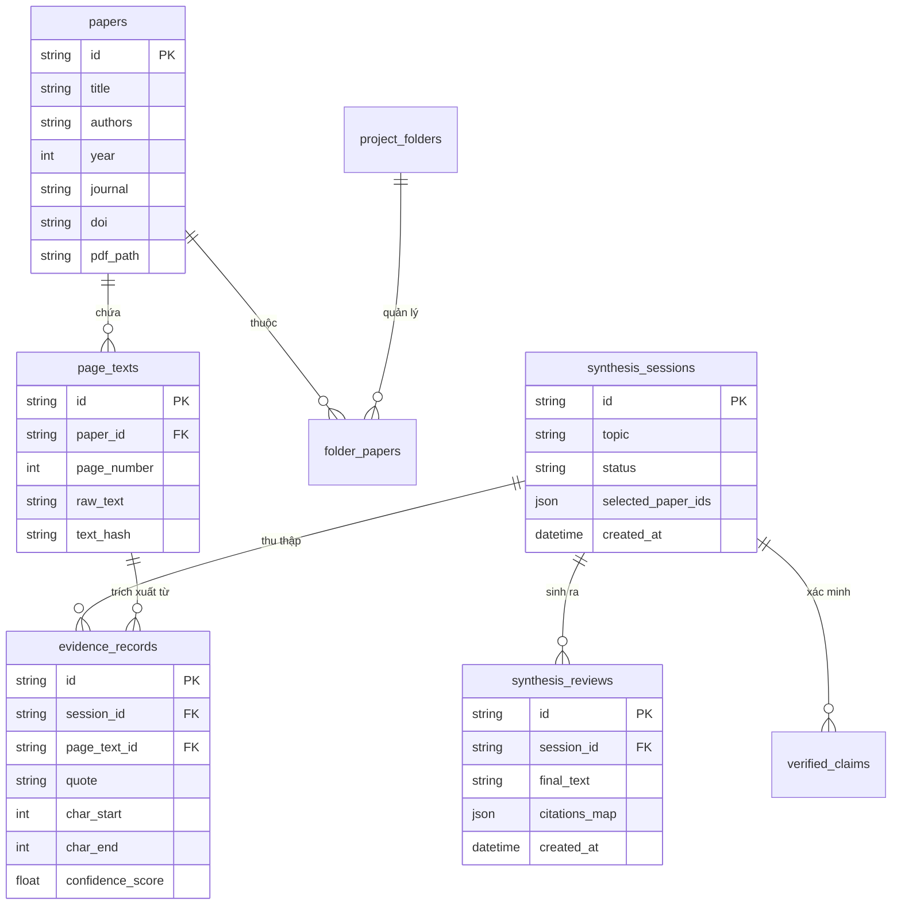

# HỆ THỐNG KIẾN TRÚC TỔNG QUAN — LITERATURE REVIEW AI AGENT (P-165)
> **Cập nhật ngày:** 11/08/2026  
> **Phiên bản:** v2.0 (Evidence-Driven Multi-Agent Synthesis & Ingestion Provenance)

---

## 1. TỔNG QUAN HỆ THỐNG (SYSTEM OVERVIEW)

Hệ thống **AI20K Agent (P-165)** là một nền tảng hỗ trợ nghiên cứu học thuật cao cấp, được xây dựng theo kiến trúc **Multi-Agent / RAG nâng cao (Evidence-Driven)** chống ảo giác (Anti-hallucination).

Hệ thống bao gồm 2 Agent chính:
1. **Single-Turn Chat Agent (LangGraph)**: Xử lý hỏi đáp nhanh từng câu hỏi dựa trên các tài liệu đã tải lên với luồng `retrieve → guard → draft`.
2. **Deep Literature Review Synthesis Engine (LangGraph Map-Reduce)**: Xử lý tổng quan tài liệu chuyên sâu đa bài báo (Multi-Paper Synthesis) theo mô hình Map-Reduce bất đồng bộ qua **Celery + Redis**, trích xuất bằng chứng theo offset ký tự gốc (`page_char_start/end`) và tự động đối chiếu trích dẫn bằng mã (Code Citation Resolver).

---

## 2. SƠ ĐỒ KIẾN TRÚC TỔNG THỂ (SYSTEM ARCHITECTURE DIAGRAM)



---

## 3. LUỒNG DỮ LIỆU TỔNG QUAN TÀI LIỆU CHUYÊN SÂU (SYNTHESIS DATAFLOW)

Luồng xử lý **Multi-Paper Synthesis** chạy theo mô hình **Map-Reduce / Send API của LangGraph**:



---

## 4. CHI TIẾT CÁC THÀNH PHẦN NÂNG CẤP CHÍNH (KEY COMPONENTS)

### 4.1. Ingestion Provenance & Data Traceability (`src/services/ingestion_service.py`)
- **PageText Storage**: Lưu nguyên văn bản thô của từng trang PDF (`page_number`, `raw_text`) vào cơ sở dữ liệu.
- **Canonical Chunk ID & Offsets**: Mỗi đoạn chunk được tạo ID duy nhất `canonical_chunk_id` kèm vị trí ký tự đầu/cuối chính xác (`page_char_start`, `page_char_end`).
- **Re-ingestion Safety**: Tách biệt việc tạo staging vector mới và dọn dẹp vector cũ, tránh tình trạng rollback DB làm mất dữ liệu.

### 4.2. Integrity Guard (`src/services/integrity_service.py` & `src/agents/nodes/guard_node.py`)
- Tra cứu real-time DOI qua Crossref API (`https://api.crossref.org/works/{doi}`).
- Tự động phát hiện các bài báo đã bị rút (**Retracted Paper**) và chặn lại trước khi đưa vào luồng tổng hợp.
- Trả về danh sách `blocked_sources` phục vụ công tác đánh giá an toàn (Safety Evaluation Evidence).

### 4.3. Grounding Service (`src/services/grounding_service.py`)
- Khớp trích dẫn bằng mã máy tính (Deterministic Code Matching) với cửa sổ ngữ cảnh `raw_text[n-1:n+1]`.
- Xử lý gạch nối xuống dòng của file PDF (PDF hyphenation) và khoảng trắng thừa.
- Cơ chế **Retry Grounding tối đa 2 lần** nếu phát hiện trích dẫn hỏng, không bỏ sót bằng chứng.

### 4.4. Code Citation Resolver & Strict Pydantic Control
- **Chặn LLM tự tiện bịa trích dẫn**: Pydantic schema chặn không cho LLM tự chèn kí hiệu trích dẫn dạng `[1]`, `[2]`.
- Trích dẫn được tính toán và gắn hoàn toàn bằng mã Python (`Citation Resolver`) dựa trên `Paper ID`, `Evidence ID`, `Page`, và `Char Offsets`.

---

## 5. CƠ SỞ DỮ LIỆU HỆ THỐNG (DATABASE SCHEMA)



---

## 6. QUẢN LÝ CẤU HÌNH & LINH HOẠT MODEL (CONFIG & HYBRID MODELS)

| Thành phần | Công nghệ / Model mặc định | Tùy chọn chuyển đổi linh hoạt |
|---|---|---|
| **Chat LLM** | `meta-llama/llama-3.3-70b-instruct:free` (via OpenRouter) | `gpt-4o-mini`, `gemini-2.0-flash-exp:free`, `deepseek-r1:free` |
| **Vector Embedding** | `sentence-transformers/all-MiniLM-L6-v2` (Local 100%) | `GoogleGenerativeAIEmbeddings` (`text-embedding-004`), `OpenAIEmbeddings` |
| **Vector Store** | `ChromaDB` (Embedded / Docker) | `Qdrant` |
| **Task Queue** | `Celery` + `Redis` | Synchronous Direct Invocation |
| **Relational DB** | `SQLite` (`./data/app.db`) | `PostgreSQL` |

---

## 7. QUY TRÌNH KIỂM THỬ VÀ XÁC NHẬN (VERIFICATION & TESTING)

1. **Biên dịch Python Syntax**:
   ```bash
   python -m compileall src/
   ```
   *Kết quả: OK 100% (0 lỗi syntax).*

2. **Kiểm tra Integrity Guard với DOI Retracted**:
   - Test DOI bị rút: `10.1002/cbic.202400798` $\rightarrow$ Trả về `status: retracted`.

3. **Kiểm tra Synthesis API**:
   - `POST /api/v1/workspace/upload`: Lưu PDF + bóc tách `PageText` chuẩn hóa.
   - `POST /api/v1/synthesis/sessions`: Đăng ký session Synthesis bất đồng bộ.
   - `GET /api/v1/synthesis/sessions/{id}`: Polling tiến độ và nhận kết quả Literature Review kèm `citations` chuẩn xác.
