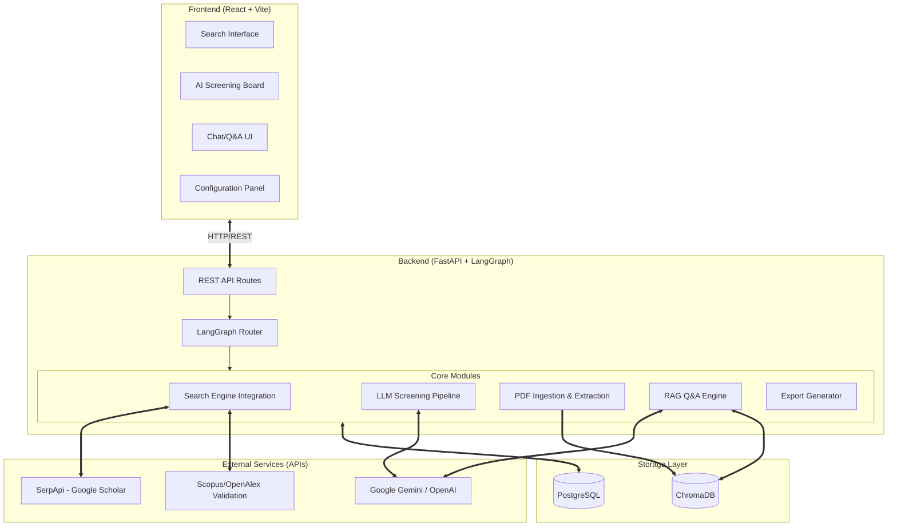
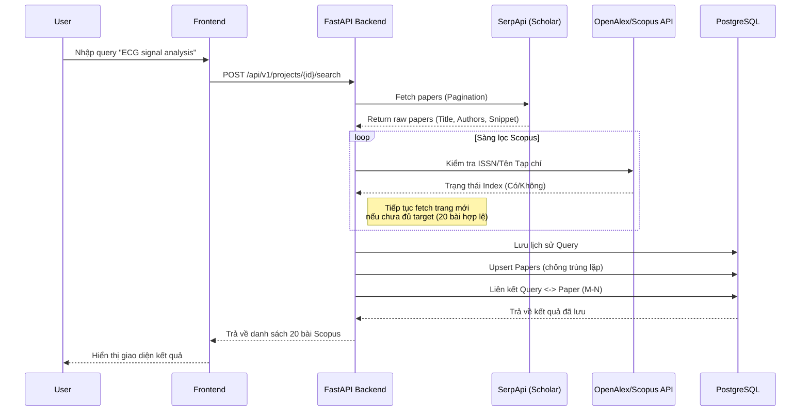
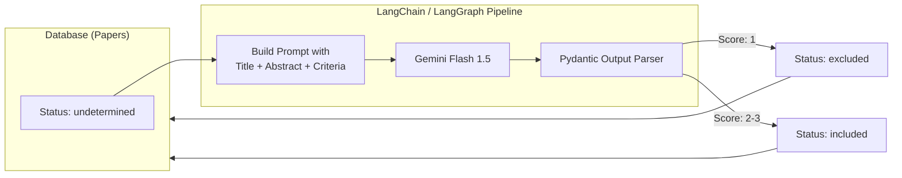
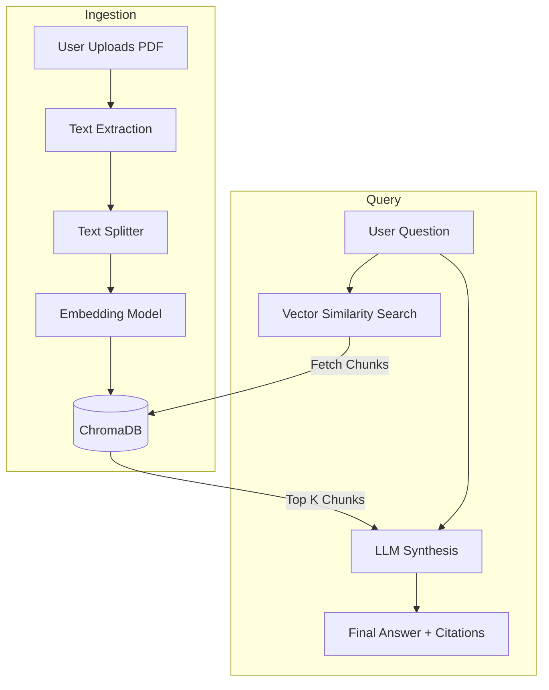

# System Architecture & Data Flow

Dự án **LitReview Agent** được thiết kế theo kiến trúc Client-Server hiện đại, kết hợp với luồng xử lý AI (Agentic Workflow) sử dụng LangGraph để tự động hóa các tác vụ nghiên cứu.

## 1. High-Level Architecture

Sơ đồ dưới đây mô tả kiến trúc tổng thể, từ giao diện người dùng (Frontend) kết nối đến API Server (Backend), và tương tác với các external services (LLM, Search API).

---

## 2. Data Flow: Search & Verify Pipeline

Luồng xử lý khi người dùng thực hiện một truy vấn tìm kiếm mới. Trọng tâm của phase này là lấy đủ dữ liệu từ Google Scholar và xác minh tính hợp lệ (thuộc danh mục Scopus).

---

## 3. Data Flow: AI Screening

Quá trình sử dụng LLM để đánh giá mức độ phù hợp của bài báo đối với chủ đề nghiên cứu.

---

## 4. RAG Chat & Synthesis Architecture

Luồng xử lý Q&A với tài liệu PDF đã upload.

